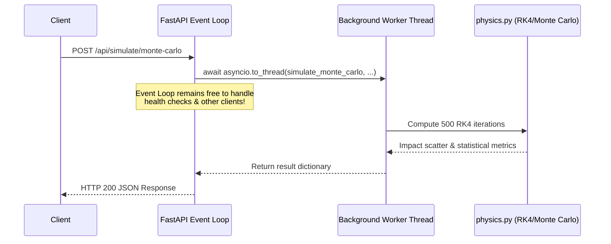

# ⚙️ AeroKinematics: Backend Architecture & API Specification

This document details the backend engineering, asynchronous pipeline, REST API endpoints, Pydantic validation models, performance optimizations, and deployment procedures for **AeroKinematics**.

---

## 📑 Table of Contents
1. [System Overview & Tech Stack](#1-system-overview--tech-stack)
2. [Module Breakdown & File Structure](#2-module-breakdown--file-structure)
3. [Asynchronous Execution Model](#3-asynchronous-execution-model)
4. [REST API Endpoints](#4-rest-api-endpoints)
   - [`POST /api/simulate`](#41-post-apisimulate)
   - [`POST /api/simulate/monte-carlo`](#42-post-apisimulatemonte-carlo)
   - [`POST /api/export/csv`](#43-post-apiexportcsv)
   - [`GET /api/health` & `GET /`](#44-get-apihealth--get-)
5. [Input Validation & Pydantic Schemas](#5-input-validation--pydantic-schemas)
6. [Numerical Stability & Safety Safeguards](#6-numerical-stability--safety-safeguards)
7. [Testing & Continuous Verification](#7-testing--continuous-verification)
8. [Deployment & Production Guide](#8-deployment--production-guide)

---

## 1. System Overview & Tech Stack

AeroKinematics' backend is engineered using modern, production-grade Python tools:

| Component | Technology | Version | Purpose |
| :--- | :--- | :--- | :--- |
| **Framework** | FastAPI | `>= 0.100.0` | Asynchronous high-performance REST API routing |
| **ASGI Server** | Uvicorn | `>= 0.22.0` | Production ASGI web server |
| **Validation** | Pydantic v2 | `>= 2.0.0` | Strict schema validation and data parsing |
| **Vector Engine** | NumPy | `>= 1.24.0` | Vectorized random sampling & fast statistical analysis |
| **Runtime** | Python | `3.11+` | Core computational platform |

---

## 2. Module Breakdown & File Structure

```
rocket_calculation_full/
├── backend/
│   ├── __init__.py          # Module package initializer
│   ├── main.py              # FastAPI application, CORS, schemas, and endpoint routers
│   └── physics.py           # Core ODE solver, RK4, Euler, atmospheric models, Monte Carlo
├── test_backend.py          # Automated verification test suite
├── requirements.txt         # Package dependencies
└── README.md
```

### 2.1 `backend/physics.py`
The mathematical and scientific engine of the system.
- `_calculate_derivatives()`: Evaluates accelerations with 2D relative wind and altitude decay.
- `_simulate_ideal()`: Closed-form analytical projectile trajectory.
- `_simulate_euler()`: First-order numerical integration.
- `_simulate_rk4()`: Fourth-order Runge-Kutta integration.
- `_interpolate_landing()`: Resolves exact ground impact without over-shooting.
- `_fast_rk4_impact()`: Lightweight loop-optimized RK4 solver returning only $(x_{\text{impact}}, t_{\text{flight}})$.
- `simulate_monte_carlo()`: Runs $N$ stochastic iterations with Gaussian distributions.
- `generate_trajectory_csv()`: Formats telemetry logs into streaming CSV data.

### 2.2 `backend/main.py`
The interface layer between clients and the physics engine.
- Configures `CORSMiddleware` (allowing cross-origin requests from web frontends).
- Defines request and response models with strict boundary validation.
- Routes requests to non-blocking worker threads.
- Implements streaming CSV file responses with proper RFC 6266 headers.

---

## 3. Asynchronous Execution Model

Numerical ODE integration and Monte Carlo iterations are **CPU-bound** operations. Executing CPU-bound calculations directly inside standard async event loop functions blocks all other incoming HTTP requests.

AeroKinematics resolves this by utilizing Python's `asyncio.to_thread`:



---

## 4. REST API Endpoints

### 4.1 `POST /api/simulate`
Computes all 3 simultaneous trajectories (Ideal, Euler, RK4).

#### Request Body
```json
{
  "v0": 75.0,
  "angle_deg": 45.0,
  "mass": 1.5,
  "k": 0.015,
  "wind_x": -5.0,
  "wind_y": 0.0,
  "g": 9.81,
  "dt": 0.01,
  "use_variable_atmosphere": true
}
```

#### Response (HTTP 200)
```json
{
  "parameters": {
    "v0": 75.0,
    "angle_deg": 45.0,
    "mass": 1.5,
    "k": 0.015,
    "wind_x": -5.0,
    "wind_y": 0.0,
    "g": 9.81,
    "dt": 0.01,
    "use_variable_atmosphere": true
  },
  "trajectories": {
    "ideal": {
      "summary": { "max_height": 143.48, "max_range": 573.90, "flight_time": 10.81, "impact_velocity": 75.0 },
      "points": [ { "time": 0.0, "x": 0.0, "y": 0.0, "vx": 53.03, "vy": 53.03, "Ek": 4218.75, "Ep": 0.0, "Em": 4218.75 }, ... ]
    },
    "euler": {
      "summary": { "max_height": 62.45, "max_range": 158.20, "flight_time": 7.02, "impact_velocity": 31.42 },
      "points": [ ... ]
    },
    "rk4": {
      "summary": { "max_height": 62.31, "max_range": 158.15, "flight_time": 7.01, "impact_velocity": 31.38 },
      "points": [ ... ]
    }
  }
}
```

---

### 4.2 `POST /api/simulate/monte-carlo`
Performs stochastic dispersion simulation using Gaussian distributions.

#### Request Body
```json
{
  "v0": 100.0,
  "angle_deg": 45.0,
  "mass": 2.0,
  "k": 0.01,
  "wind_x": -3.0,
  "wind_y": 0.0,
  "g": 9.81,
  "dt": 0.01,
  "use_variable_atmosphere": false,
  "num_simulations": 100,
  "v0_std_dev": 2.5,
  "angle_std_dev": 1.0
}
```

#### Response (HTTP 200)
```json
{
  "num_simulations": 100,
  "base_parameters": { ... },
  "summary": {
    "mean_range": 354.21,
    "std_dev_range": 12.45,
    "min_range": 322.18,
    "max_range": 387.94,
    "ci_95_mean_margin": 2.44,
    "dispersion_radius_95": 24.40
  },
  "impact_points": [
    { "x": 352.1, "y": 0.0, "flight_time": 9.42, "v0": 99.8, "angle_deg": 44.9 },
    { "x": 358.4, "y": 0.0, "flight_time": 9.51, "v0": 101.2, "angle_deg": 45.3 }
  ]
}
```

---

### 4.3 `POST /api/export/csv`
Runs trajectory integration and streams a `.csv` file directly for download.

#### Request Body
```json
{
  "v0": 50.0,
  "angle_deg": 45.0,
  "mass": 1.0,
  "k": 0.01,
  "wind_x": 0.0,
  "wind_y": 0.0,
  "g": 9.81,
  "dt": 0.01,
  "method": "rk4"
}
```

#### Response Headers & Data
- `Content-Type: text/csv; charset=utf-8`
- `Content-Disposition: attachment; filename="trajectory_rk4_50ms_45deg.csv"`

```csv
time,x,y,vx,vy,kinetic_energy,potential_energy,total_energy
0.0000,0.0000,0.0000,35.3553,35.3553,1250.0000,0.0000,1250.0000
0.0100,0.3536,0.3531,35.1787,35.0805,1233.9852,3.4639,1237.4491
...
5.2714,97.3821,0.0000,18.4215,-14.8821,280.4501,0.0000,280.4501
```

---

### 4.4 `GET /api/health` & `GET /`
Service health check and Swagger documentation redirects.

```json
{
  "status": "online",
  "service": "2D Projectile Motion Simulation API",
  "version": "1.2.0",
  "docs_url": "/docs"
}
```

---

## 5. Input Validation & Pydantic Schemas

Every input parameter is validated at the boundary before execution:

| Parameter | Type | Validation Constraint | Description |
| :--- | :--- | :--- | :--- |
| `v0` | `float` | `gt=0.0, le=2500.0` | Launch velocity (strictly positive) |
| `angle_deg` | `float` | `ge=0.0, le=90.0` | Launch angle in degrees |
| `mass` | `float` | `gt=0.0` | Mass in kg (prevents zero-division) |
| `k` | `float` | `ge=0.0` | Aerodynamic drag coefficient |
| `wind_x` | `float` | No constraint | Horizontal wind component (m/s) |
| `wind_y` | `float` | No constraint | Vertical wind component (m/s) |
| `g` | `float` | `gt=0.0` | Gravitational constant (m/s²) |
| `dt` | `float` | `gt=0.0, le=0.1` | Time-step resolution (s) |
| `use_variable_atmosphere` | `bool` | `True / False` | Toggle barometric & gravity decay |
| `num_simulations` | `int` | `ge=50, le=500` | Sample size for Monte Carlo |
| `v0_std_dev` | `float` | `ge=0.0` | Velocity Gaussian standard deviation |
| `angle_std_dev` | `float` | `ge=0.0` | Angle Gaussian standard deviation |

Any violation triggers a standard FastAPI **HTTP 422 Unprocessable Entity** error with field-level diagnostics:
```json
{
  "detail": [
    {
      "type": "greater_than",
      "loc": ["body", "mass"],
      "msg": "Input should be greater than 0",
      "input": 0.0
    }
  ]
}
```

---

## 6. Numerical Stability & Safety Safeguards

1. **Division-by-Zero Protection**:
   - `mass` is validated with `gt=0.0` at the Pydantic layer and checked in `_calculate_derivatives`.
2. **Infinite Loop Safeguards**:
   - Simulation loops are bounded by `max_steps = 100_000` (or `50_000` in Monte Carlo) preventing CPU stalls if impossible physics parameters are passed.
3. **Altitude Under-flow Clamping**:
   - When computing $\rho(y)$ and $g(y)$, altitude is clamped with `max(0.0, y)` to prevent density explosion underground.
4. **Exact Impact Termination**:
   - When $y_{n+1} < 0$, linear interpolation determines the exact $(x_{\text{impact}}, 0.0)$ point and breaks cleanly.

---

## 7. Testing & Continuous Verification

The backend includes a dedicated unit test suite in [test_backend.py](file:///c:/Users/LEO%20SYAFIQ/rocket_calculation_full/test_backend.py):

To execute tests:
```powershell
python test_backend.py
```

### Verified Scenarios:
1. Ideal conservation of mechanical energy ($E_m(0) \approx E_m(T_{\text{flight}})$).
2. Aerodynamic drag dissipation ($\Delta E_m > 0$).
3. Variable atmosphere range expansion under high-altitude test conditions.
4. Monte Carlo $N$-run sample statistics and confidence interval validity.
5. Pydantic validation intercepting invalid inputs (e.g. `mass=0`, `num_simulations=20`) with HTTP 422.
6. CSV export formatting and header structure.

---

## 8. Deployment & Production Guide

### Local Development
```powershell
python backend/main.py
```

### Production ASGI Execution
Using Uvicorn with multiple worker processes:
```bash
uvicorn backend.main:app --host 0.0.0.0 --port 8000 --workers 4 --proxy-headers
```

### Production Dockerfile Example
```dockerfile
FROM python:3.11-slim

WORKDIR /app
COPY requirements.txt .
RUN pip install --no-cache-dir -r requirements.txt

COPY . .

EXPOSE 8000
CMD ["uvicorn", "backend.main:app", "--host", "0.0.0.0", "--port", "8000", "--workers", "4"]
```
